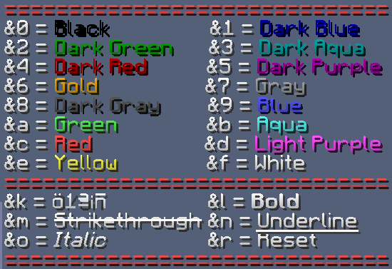

# 🧩 Craftables

## Filtered Hoppers

With the Magic Hopper Thing, you can click on hoppers and set a filter! No more lengthy redstone! You can choose to turn the filter on, off, whitelist, blacklist. Even have it set to exact match.&#x20;

.png>)

## Auto Shulker

With Auto Shulker you can now craft a Shulker Box that automatically picks up certain items!

.png>)

You just have to place an empty shulker box, a book, and then whatever item(s) you want it to auto collect - It's that simple.&#x20;

## Anvil Color

With a Donator(VIP) or Donator+(VIP+) role, we allow the use of colors in the Anvil. Below are the codes for Formatting the Name.

